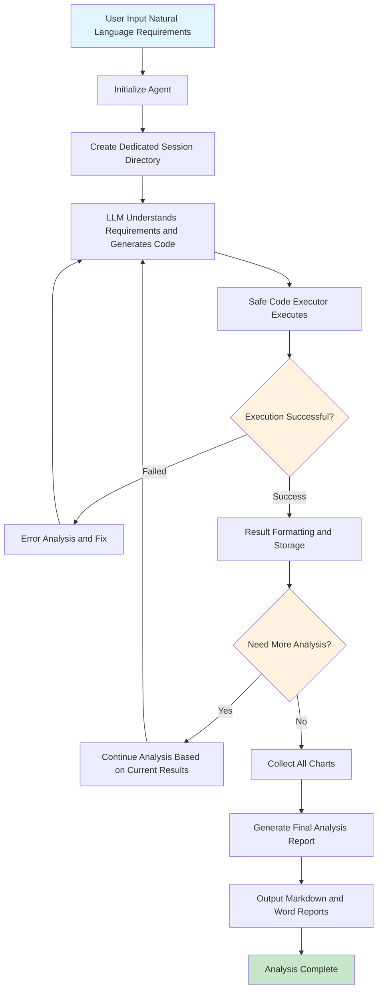
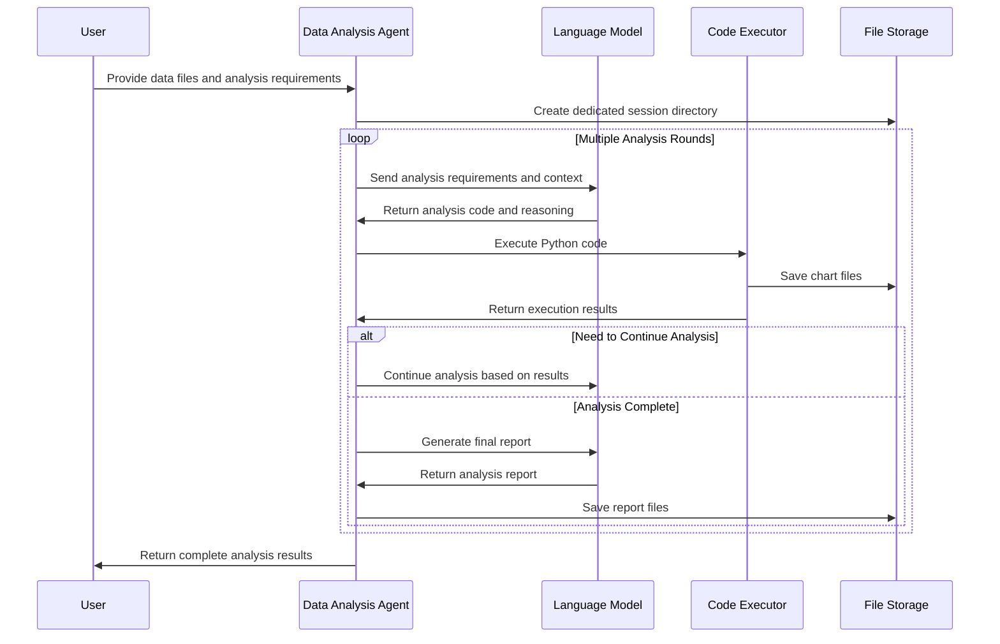
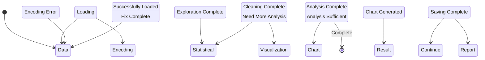

# Data Analysis Agent

🤖 **LLM-based Intelligent Data Analysis Agent**

[](https://python.org)
[](LICENSE)
[](https://openai.com)

## 📋 Project Overview


The Data Analysis Agent is a powerful Python tool that combines the understanding capabilities of Large Language Models (LLM) with the computational power of Python data analysis libraries, enabling:

- 🎯 **Natural Language Analysis**: Accepts user's natural language requirements and automatically generates professional data analysis code
- 📊 **Intelligent Visualization**: Automatically generates high-quality charts with Chinese display support, outputting to dedicated directories
- 🔄 **Iterative Optimization**: Automatically adjusts analysis strategies based on execution results, continuously optimizing analysis quality
- 📝 **Report Generation**: Automatically generates professional reports (Markdown + Word) containing charts and analysis conclusions
- 🛡️ **Safe Execution**: Safely executes code in a restricted environment, supporting commonly used data analysis libraries

## 🏗️ Project Architecture

```
data_analysis_agent/
├── 📁 config/                 # Configuration management
│   ├── __init__.py
│   └── llm_config.py          # LLM configuration (API keys, models, etc.)
├── 📁 utils/                  # Core utility modules
│   ├── code_executor.py       # Safe code executor
│   ├── llm_helper.py          # LLM call helper class
│   ├── fallback_openai_client.py  # OpenAI client with failover support
│   ├── extract_code.py        # Code extraction utility
│   ├── format_execution_result.py  # Execution result formatting
│   └── create_session_dir.py  # Session directory management
├── 📄 data_analysis_agent.py  # Main agent class
├── 📄 prompts.py              # System prompt templates
├── 📄 main.py                 # Usage examples
├── 📄 requirements.txt        # Project dependencies
├── 📄 .env                    # Environment variable configuration
└── 📁 outputs/                # Analysis results output directory
    └── session_[UUID]/        # Independent session directory for each analysis
        ├── *.png             # Generated charts
        ├── Final_Analysis_Report.md    # Markdown report
        └── Final_Analysis_Report.docx  # Word report
```

## 📊 Data Analysis Flow Diagram

Using Mermaid diagrams to display the complete data analysis flow:



## 🔄 Agent Workflow



## ✨ Core Features

### 🧠 Intelligent Analysis Flow

- **Multi-stage Analysis**: Data exploration → Cleaning checks → Analysis visualization → Image collection → Report generation
- **Error Self-healing**: Automatically detects and fixes common errors (encoding, column names, data types, etc.)
- **Context Preservation**: Variables and state in the Notebook environment persist throughout the analysis process

### 📋 Multi-format Reports

- **Markdown Reports**: Structured analysis reports containing chart references
- **Word Documents**: Professional document format, easy to share and print
- **Image Integration**: Automatically references generated charts in reports

## 🚀 Quick Start

### 1. Environment Setup

```bash
# Clone the project
git clone  https://github.com/li-xiu-qi/data_analysis_agent.git

cd data_analysis_agent

# Install dependencies
pip install -r requirements.txt
```

### 2. Configure API Keys

Create a `.env` file:

```bash
# OpenAI API configuration
OPENAI_API_KEY=your_api_key_here
OPENAI_BASE_URL=https://api.openai.com/v1
OPENAI_MODEL=gpt-4

# Or use compatible APIs (e.g., Volcengine)
# OPENAI_BASE_URL=https://ark.cn-beijing.volces.com/api/v3
# OPENAI_MODEL=deepseek-v3-250324
```

### 3. Basic Usage

```python
from data_analysis_agent import DataAnalysisAgent
from config.llm_config import LLMConfig

# Initialize agent
llm_config = LLMConfig()
agent = DataAnalysisAgent(llm_config)

# Start analysis
files = ["your_data.csv"]
report = agent.analyze(
    user_input="Analyze sales data, generate trend charts and key metrics",
    files=files
)

print(report)
```

```python
# Custom configuration
agent = DataAnalysisAgent(
    llm_config=llm_config,
    output_dir="custom_outputs",  # Custom output directory
    max_rounds=30                 # Increase maximum analysis rounds
)

# Use convenience function
from data_analysis_agent import quick_analysis

report = quick_analysis(
    query="Analyze user behavior data, focusing on conversion rate",
    files=["user_behavior.csv"],
    max_rounds=15
)
```

## 📊 Usage Examples

The following is a complete example of analyzing Kweichow Moutai financial data:

```python
# Example: Moutai financial analysis
files = ["贵州茅台利润表.csv"]
report = agent.analyze(
    user_input="Based on Kweichow Moutai data, output five important statistical indicators and draw related charts. Finally generate a report for me.",
    files=files
)
```

**Generated analysis content includes:**

- 📈 Operating revenue trend chart
- 💰 Net profit margin change analysis
- 📊 Profit composition analysis chart
- 💵 Earnings per share change trend
- 📋 Operating cost ratio analysis
- 📄 Comprehensive analysis report

## 🎨 Process Visualization

### 📊 Analysis Process State Diagram



## 🔧 Configuration Options

### LLM Configuration

```python
@dataclass
class LLMConfig:
    provider: str = "openai"
    api_key: str = os.environ.get("OPENAI_API_KEY", "")
    base_url: str = os.environ.get("OPENAI_BASE_URL", "https://api.openai.com/v1")
    model: str = os.environ.get("OPENAI_MODEL", "gpt-4")
    max_tokens: int = 4000
    temperature: float = 0.1
```

### Executor Configuration

```python
# Allowed library list
ALLOWED_IMPORTS = {
    'pandas', 'numpy', 'matplotlib', 'duckdb', 
    'scipy', 'sklearn', 'plotly', 'requests',
    'os', 'json', 'datetime', 're', 'pathlib'
}
```

## 🎯 Best Practices

### 1. Data Preparation

- ✅ Use CSV format, support UTF-8/GBK encoding
- ✅ Ensure column names are clear and free of special characters
- ✅ Moderate data size (recommended <100MB)

### 2. Query Writing

- ✅ Use clear descriptions of analysis requirements
- ✅ Specify desired chart types and key metrics
- ✅ Clearly define analysis objectives and focus areas

### 3. Result Interpretation

- ✅ Check if generated charts meet expectations
- ✅ Read key findings in the analysis report
- ✅ Adjust queries and re-analyze as needed

## 🚨 Important Notes

### Security Restrictions

- 🔒 Only supports predefined data analysis libraries
- 🔒 File system operations not allowed (except image saving)
- 🔒 Network requests not supported (except LLM calls)

### Performance Considerations

- ⚡ Large datasets may result in longer analysis times
- ⚡ Complex analysis tasks may require multiple rounds of interaction
- ⚡ API call frequency is limited by model restrictions

### Compatibility

- 🐍 Python 3.8+
- 📊 Supports pandas-compatible data formats
- 🖼️ Requires matplotlib Chinese font support

## 🐛 Troubleshooting

### Common Issues

**Q: Chinese characters in charts display as boxes?**
A: Ensure SimHei font is installed on the system, or specify other Chinese fonts in the code.

**Q: API call failed?**
A: Check API keys and endpoint configuration in the `.env` file, ensure network connection is normal.

**Q: Data loading error?**
A: Check file paths and encoding format, supports UTF-8, GBK and other common encodings.

**Q: Analysis results inaccurate?**
A: Try providing more detailed analysis requirements, or check original data quality.

**Q: Mermaid flow diagrams not displaying properly?**
A: Ensure viewing in a Mermaid-supported environment (such as GitHub, Typora, VS Code preview, etc.). For local viewing, it's recommended to use a Markdown editor that supports Mermaid.

**Q: How to customize flow diagram styles?**
A: You can add style definitions in Mermaid code blocks, or use different diagram types (graph, flowchart, sequenceDiagram, etc.) to meet different display needs.

### Error Logs

Error information during the analysis process is saved in the session directory for debugging and optimization.

## 🤝 Contributing

Contributions and improvement suggestions are welcome!

1. Fork the project
2. Create a feature branch
3. Commit changes
4. Push to the branch
5. Create a Pull Request

## 📄 License

This project is open source under the MIT License. See the [LICENSE](LICENSE) file for details.

## 🔄 Changelog

### v1.0.0

- ✨ Initial version release
- 🎯 Support for natural language data analysis
- 📊 Integrated matplotlib chart generation
- 📝 Automatic report generation functionality
- 🔒 Safe code execution environment

---

<div align="center">

**🚀 Making data analysis smarter and simpler!**

</div>

Executive Summary (short answer) (Graphs)
1. What is the answer
2. Where is the evidence
3. Why does this matter
Key Insights (Graphs)
Trend Analysis (Comparison) (Graphs)
Recommendations / Suggestions
